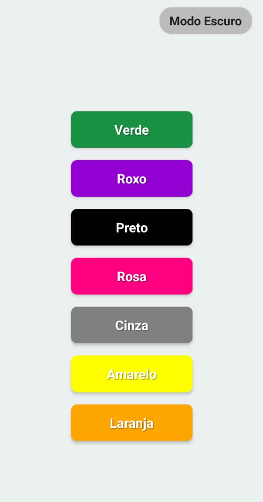

# Jogo das Cores Stop

Um aplicativo acessível e interativo inspirado no jogo de cartas "Cool Camels Snap", adaptado para terapia ocupacional. Ele auxilia pessoas que não falam, permitindo que o aplicativo pronuncie o nome das cores, e também pessoas com deficiência visual, pois o nome da cor é falado em voz alta ao tocar no botão correspondente. Desenvolvido com React Native e Expo, o app promove inclusão ao facilitar a participação de diferentes públicos no jogo adaptado "Stop".




## Estrutura do Projeto

```
JogoDasCoresStop/
├── App.js
├── index.js
├── package.json
├── app.json
├── eas.json
├── assets/
│   ├── adaptive-icon.png
│   ├── favicon.png
│   ├── icon.png
│   └── splash-icon.png
└── ...
```


## Funcionalidades

- Exibe botões coloridos com nomes das cores.
- Ao pressionar um botão, o nome da cor é pronunciado em português (usando TTS).
- Animação de escala ao pressionar os botões.
- Alternância entre modo claro e escuro.
- Splash screen personalizada.

## Tecnologias Utilizadas

- [React Native](https://reactnative.dev/)
- [Expo](https://expo.dev/)
- [expo-speech](https://docs.expo.dev/versions/latest/sdk/speech/)
- [expo-splash-screen](https://docs.expo.dev/versions/latest/sdk/splash-screen/)

## Instalação

1. **Clone o repositório:**
   ```sh
   git clone https://github.com/seu-usuario/JogoDasCoresStop.git
   cd JogoDasCoresStop
    ```
2. **Instale as dependências:**

3. ```sh
   npx expo install
   ```
4. **Inicie o aplicativo:**
   ```sh
   npx expo start
   ```

